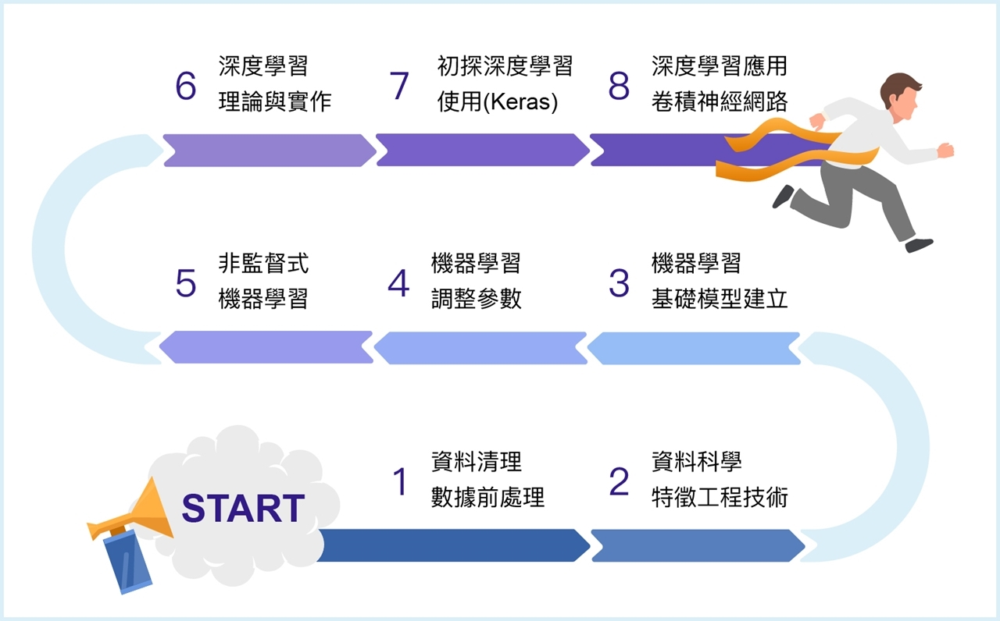

# 100 days to learn machine learning

### Road Map

> https://www.accupass.com/event/1810260306513140042440

 

## Day 01  Basic Python

I use Jupyter lab instead of Jupyter Notebook.

**Installation with pip**

Will work for both MacOS and Windows 10

`pip install jupyterlab`

**Open with chrome**

`jupyter-lab --browser=chrome`

 

## Day 02 Data Preprocessing - NumPy & Pandas

#### NumPy

NumPy是Numerical Python的縮寫，提供了大多數涉及數據科學應用所需的數據結構、演算法和功能庫

* 快速高效的多維數陣列(組對)物件(array object)ndarray

* 提供線性代數(linear algebra)運算，傅里葉變換(Fourier transform)和隨機數(random number)的生成

#### Pandas

Pandas的功能強大而且具高效的數據分析環境，Pandas的數據物件主要分為DataFrame以及Series

1. DataFrame

   有列和行標籤的列表式(tabular)，數據結構就像Excel的工作表格(spreadsheets)與資料庫的table一樣

2. Series

   Series則是一維標籤化陣列物件，適合時間序列的數據處理

   提供了複雜的索引功能(indexing)，以便輕鬆重塑(reshape)，切片和切塊(slice and dice)，執行聚合(aggregations)以及選擇數據子集合(subset)

For more info please view the `Day02 folder`

 

## Day 03 Data Preprocessing - Handle Missing Data

 

## Day 04 Data Preprocessing - Encoding Categorical Data

* sklearn - LabelEncoder, OneHotEncoder

  LabelEncoder: 將字串以離散數字表示

  OneHotEncoder: 將LabelEncoder轉出的數字轉成one-hot編碼(避免電腦誤會Label Encode後的數字大小是有意義的)

* numpy - get_dummies() 

  one-hot 編碼

 

## Day 05 Data Preprocessing -  Split data & Cross Validation

* KFlod: (pending)

 

## Day 06 Data Preprocessing - Regularization

* Min-Max-Scaler: 
* StandardScaler: 

 

## Day 07 EDA - Visualization - Matplotlib,  Seaborn & Pyplot

 

## Day 08 Save & Load Python Object - Encoder & Scaler

以pickle/ pkl格式儲存，並以下列方式讀取

* pickle：

* joblib ：sklearn的外部模組，使用最為簡單使用且可以快速讀取大型array

* cpikle：

 

## Day 09 Input Value (for prediction)

* input value while calling the python script：`import sys`

* return JSON：`import json`

  以上都是內建的不須另外安裝

 

## Day N Build Model - Scikit-learn

Python程式設計的首要機器學習軟件包，主要包含了以下模型：

* 分類(classification)：支持向量機器(Support Vector Machine;SVM)、最近鄰居(nearest neighbors)、隨機森林(random forest)、邏輯式回歸(logistic regression)等

* 回歸分析(regression)：Linear, Lasso以及ridge regression等

* 聚類(clustering)：k均值(k-means)、譜聚類(spectral clustering)等

* 模型選擇(model selection)：網格搜索(grid search)、交叉驗證(cross-validation)、度量(metric)等

* 前置處理(preprocessing)：特徵提取(feature extraction)，正規化(normalization)等

 

## Day N Linear Regression

 

## Day N Save & Load Trained Model

 

## Day N Decision Tree

#### ID3 algorithm

Tree Node挑出Information Gain最大的

#### Information Gain

Gain(X)=I(n,n1)-E(X) 

 

## Day N Classification Tree

## Day N MLP

 

## Day N CNN

## Day N R-CNN

## Day N RNN

> 細節可以參考:
> 
> https://github.com/johnny12150/ML-100-dyas/blob/master/Day01/Winter-Day05.ipynb

 

## Day N LSTM

## Day N GAN

以MNIST為例

> https://github.com/kroosen/GAN-in-keras-on-mnist
> https://github.com/Zackory/Keras-MNIST-GAN

 

## Day N RL - Q Learning

## Day N RL - Deep Q Learning
